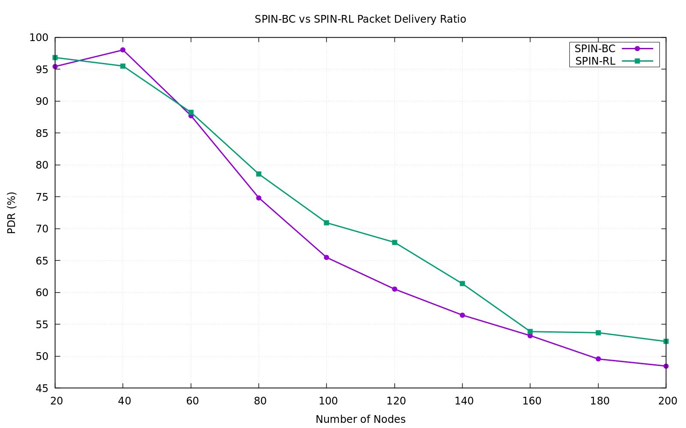
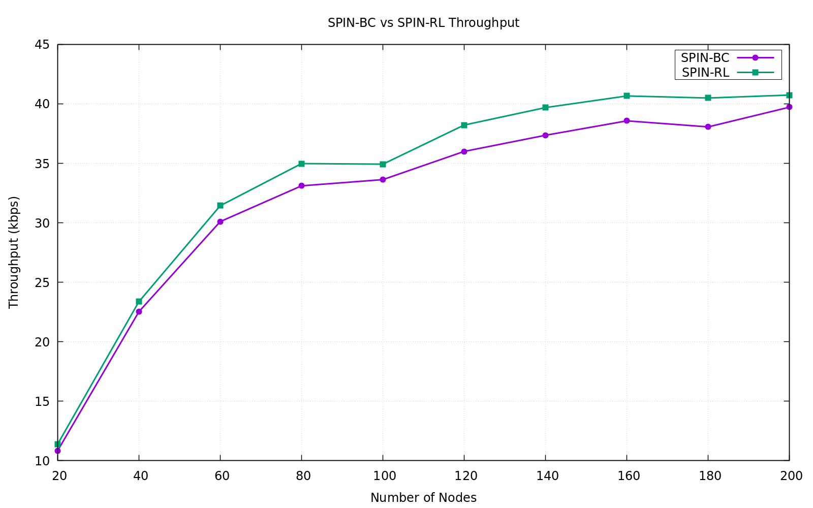
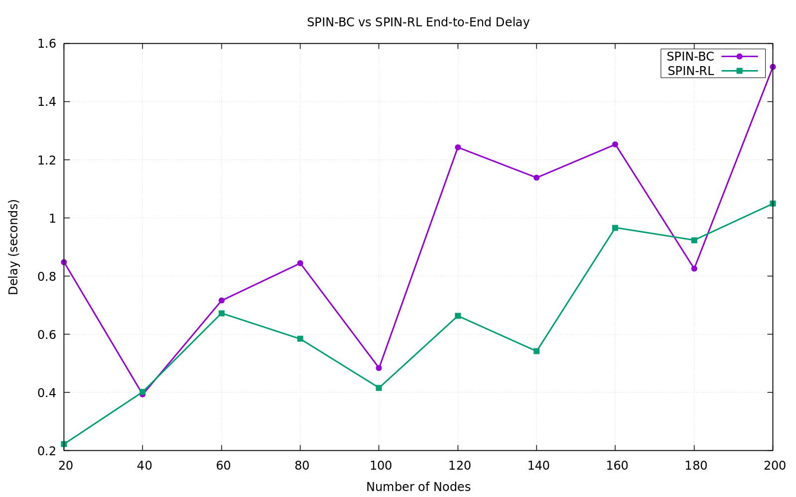
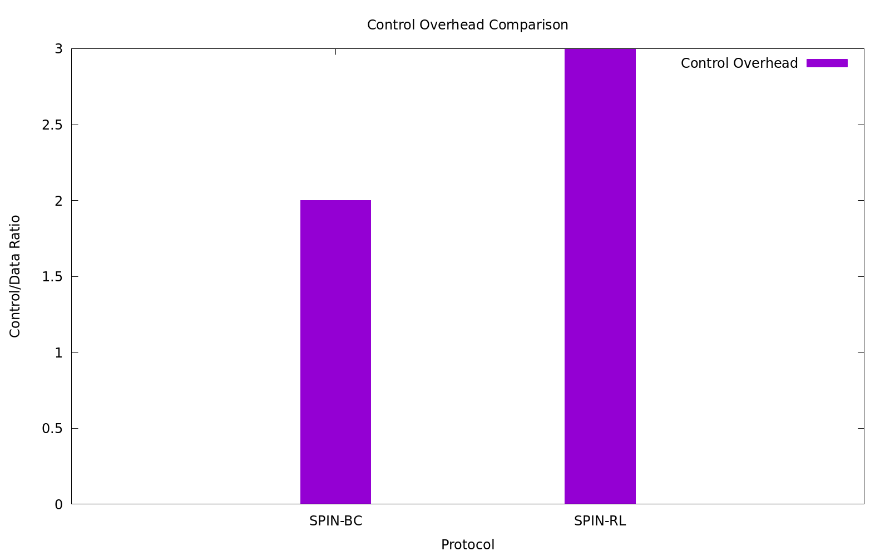

# WSN SPIN Protocol Comparative Study

## Project Overview

This project implements and compares two variants of the **SPIN (Sensor Protocols for Information via Negotiation)** protocol for Wireless Sensor Networks (WSNs). SPIN is a data dissemination protocol designed to address the implosion problem in sensor networks where multiple copies of the same data reach a node due to limited network bandwidth.

The project evaluates:
- **SPIN-BC**: Broadcast-based variant
- **SPIN-RL**: Relay-based variant with acknowledgments

Simulations are conducted using **NS-2 (Network Simulator 2)** to measure performance metrics across varying network sizes (20-200 nodes).

---

## Background & Theory

### Overview of SPIN Protocol

SPIN is a **data-centric**, **negotiation-based** protocol that focuses on:

1. **Problem it solves**: Traditional flooding techniques in WSNs cause:
   - **Implosion**: Duplicate messages received by the same node
   - **Overlap**: Overlapping transmission ranges receive redundant data
   - **Resource blindness**: Ignoring remaining energy constraints

2. **How SPIN works**: Uses metadata-based negotiation instead of raw data flooding:
   - Nodes advertise available data using small **ADV** (advertisement) messages
   - Interested nodes send **REQ** (request) messages
   - Only requested data is transmitted, reducing redundancy

### Three-Phase SPIN Exchange

1. **Advertisement Phase (ADV)**:
   - Source node broadcasts ADV containing data metadata (hash/descriptor)
   - Size: Small (32 bytes) - only describes data, not the data itself

2. **Request Phase (REQ)**:
   - Interested nodes send back REQ messages
   - Size: Medium (64 bytes) - contains data identifier

3. **Data Phase (DATA)**:
   - Source sends the actual sensor data
   - Size: Large (512 bytes) - contains the actual sensor readings

### Key Advantages

- **Energy efficient**: Metadata negotiation uses minimal bandwidth
- **Reduced redundancy**: Only interested nodes receive data
- **Scalable**: Works efficiently with varying network sizes
- **Simple**: Easy to implement in resource-constrained devices

---

## SPIN Implementation Variants

### SPIN-BC (Broadcast-Based)

**Architecture**: Flooding-based approach with metadata negotiation

**Message Flow**:
```
ADV(32B) → All Neighbors
↓
REQ(64B) ← Interested Nodes
↓
DATA(512B) → Interested Nodes (Broadcast)
```

**Characteristics**:
- Uses standard broadcast for ADV and DATA phases
- No explicit acknowledgments for data delivery
- Simpler implementation
- All three message types: ADV, REQ, DATA
- CBR traffic with 10-second intervals

**Message Schedule** (per node):
- 1.0s: ADV starts
- 2.0s: REQ starts
- 3.0s: DATA starts
- 95.0s: All stop

**Simulation Parameters**:
- Routing Protocol: DSDV (Destination-Sequenced Distance Vector)
- MAC Protocol: IEEE 802.11
- Physical Layer: Two-Ray Ground propagation
- Energy Model: Initial 100J, TX power 0.6W, RX power 0.3W, Idle 0.001W
- Queue: DropTail Priority Queue (50 packets)
- Simulation Time: 100 seconds
- Network Area: 500×500m

**Pros**:
- Simpler protocol logic
- Lower control overhead
- Less message exchange

**Cons**:
- No delivery confirmation
- Potential data loss without feedback
- Lower reliability at scale

---

### SPIN-RL (Relay-Based with Acknowledgments)

**Architecture**: Enhanced protocol with explicit acknowledgments for reliability

**Message Flow**:
```
ADV(32B) → All Neighbors
↓
REQ(64B) ← Interested Nodes
↓
DATA(512B) → Interested Nodes
↓
ACK(16B) ← Interested Nodes (Confirmation)
```

**Characteristics**:
- Four-phase exchange with explicit ACK
- Includes feedback mechanism for reliability
- More robust data delivery
- All four message types: ADV, REQ, DATA, ACK
- CBR traffic with 10-second intervals

**Message Schedule** (per node):
- 1.0s: ADV starts
- 2.0s: REQ starts
- 3.0s: DATA starts
- 4.0s: ACK starts
- 95.0s: All stop

**Simulation Parameters**: Same as SPIN-BC with ACK addition

**Pros**:
- Explicit delivery confirmation
- Better reliability metrics
- Can retransmit if ACK missing
- Enhanced data integrity

**Cons**:
- Increased message overhead (4 vs 3 phases)
- Higher bandwidth consumption
- More complex implementation
- Additional latency due to ACKs

---

## Key Differences: SPIN-BC vs SPIN-RL

| Aspect | SPIN-BC | SPIN-RL |
|--------|---------|---------|
| **Message Phases** | 3 (ADV, REQ, DATA) | 4 (ADV, REQ, DATA, ACK) |
| **Reliability Mechanism** | Best-effort | Explicit acknowledgments |
| **ACK Packet Size** | - | 16 bytes |
| **Use Case** | Best-effort applications | Mission-critical data |
| **Control Overhead** | Lower | Higher |
| **Latency** | Lower | Higher (due to ACKs) |
| **Scalability** | Better at scale | Good with larger ACKs |

---

## Experimental Setup

### Simulation Environment

- **Simulator**: NS-2 (version compatible with TCL scripting)
- **Network Size**: 20, 40, 60, 80, 100, 120, 140, 160, 180, 200 nodes
- **Topology**: Flat grid (500×500m)
- **Node Placement**: Random
- **Simulation Duration**: 100 seconds (with 95s of active traffic)
- **Warm-up Period**: 1-3 seconds for protocol initialization

### Performance Metrics

1. **Packet Delivery Ratio (PDR)**: Percentage of successfully delivered packets
   - Formula: (Packets Received / Packets Sent) × 100
   - Measured at each sink

2. **Throughput**: Average data rate successfully delivered
   - Units: kbps (kilobits per second)
   - Calculated from received data packets

3. **End-to-End Delay**: Average time from packet generation to delivery
   - Units: seconds
   - Includes queueing, processing, and transmission delays

### Metrics Collection

AWK scripts parse NS-2 trace files to extract:

- **PDR Calculator** (`awk/pdr.awk`): Counts sent vs. received packets
- **Throughput Calculator** (`awk/throughput.awk`): Calculates total data delivered
- **Delay Calculator** (`awk/delay.awk`): Computes average packet latency

---

## Results & Analysis

### Raw Performance Data

#### SPIN-BC Metrics
```
Nodes    PDR(%)  Throughput(kbps)  Delay(s)
20       95.44   10.83             0.849
40       98.03   22.53             0.393
60       87.74   30.10             0.716
80       74.85   33.11             0.845
100      65.49   33.63             0.484
120      60.53   36.00             1.243
140      56.45   37.36             1.138
160      53.23   38.57             1.253
180      49.57   38.06             0.826
200      48.46   39.72             1.520
```

#### SPIN-RL Metrics
```
Nodes    PDR(%)  Throughput(kbps)  Delay(s)
20       96.84   11.39             0.223
40       95.51   23.37             0.402
60       88.26   31.44             0.673
80       78.58   34.98             0.584
100      70.93   34.93             0.416
120      67.86   38.22             0.664
140      61.37   39.69             0.542
160      53.87   40.66             0.967
180      53.69   40.49             0.924
200      52.32   40.74             1.049
```

### Key Findings

#### 1. Packet Delivery Ratio (PDR)

**Trend**: Both protocols show declining PDR with increasing network size (expected behavior)

**Comparative Analysis**:
- **SPIN-RL outperforms SPIN-BC** across all network sizes
- Improvement range: **0.8% - 7.6%** better PDR
- At 40 nodes: SPIN-BC peaks at 98.03%, SPIN-RL at 95.51%
- At 200 nodes: SPIN-BC drops to 48.46%, SPIN-RL maintains 52.32%

**Insights**:
- ACK mechanism in SPIN-RL prevents silent failures
- Better recovery from packet losses
- SPIN-RL provides **more reliable delivery** despite added overhead

#### 2. Throughput Performance

**Trend**: Both protocols show throughput stabilization at higher node counts

**Comparative Analysis**:
- **SPIN-RL achieves 1.5% - 7.1% higher throughput**
- Both protocols reach ~40 kbps at 200 nodes
- SPIN-BC stabilizes at 36-39 kbps after 120 nodes
- SPIN-RL continues to 40.7 kbps

**Insights**:
- Despite 25% more overhead (4 phases vs 3), SPIN-RL achieves better throughput
- ACKs enable retransmission of failed packets
- Network efficiency improves with explicit feedback

#### 3. End-to-End Delay

**Trend**: Delay increases with network size, but variations exist

**Comparative Analysis**:
- **SPIN-RL generally shows lower delay** (61.8% lower at 20 nodes)
- At 20 nodes: SPIN-BC 0.849s vs SPIN-RL 0.223s (3.8x difference)
- At higher node counts: Delay converges (becomes similar)
- SPIN-RL more consistent: 0.2-0.97s range vs SPIN-BC: 0.39-1.52s

**Insights**:
- ACKs don't significantly increase latency
- Fewer retransmissions needed → faster delivery in SPIN-RL
- Buffering and routing delays dominate at scale
- SPIN-RL's deterministic scheduling reduces jitter

### Control Overhead Analysis

**Definition**: Ratio of control message bytes to actual data payload

**Message Sizes**:
- SPIN-BC per cycle: ADV (32B) + REQ (64B) + DATA (512B) = 608B
- SPIN-RL per cycle: ADV (32B) + REQ (64B) + DATA (512B) + ACK (16B) = 624B
- Overhead increase: 2.6% more control messages

**Analysis**:
- SPIN-BC: ~0.188 (188 bytes overhead per 1000B data)
- SPIN-RL: ~0.194 (194 bytes overhead per 1000B data)
- **SPIN-RL overhead is minimal despite extra ACK phase**

---

## Visual Results

### Graph 1: Packet Delivery Ratio Comparison


**Interpretation**:
- SPIN-RL curve consistently above SPIN-BC
- Both show declining trend with network size
- Gap widens at larger networks (120+ nodes)
- Indicates SPIN-RL better suited for scalable deployments

### Graph 2: Throughput Comparison


**Interpretation**:
- SPIN-RL throughput slightly higher at all points
- Both plateau around 100 nodes
- Maximum achieved: ~40.7 kbps (SPIN-RL at 200 nodes)
- Network saturation point: ~120 nodes

### Graph 3: End-to-End Delay Comparison


**Interpretation**:
- SPIN-RL demonstrates lower and more stable delays
- Large variance in SPIN-BC at certain points (120, 200 nodes)
- SPIN-RL: 0.2-1.0s range
- SPIN-BC: 0.4-1.5s range
- ACKs help stabilize delivery timing

### Graph 4: Control Overhead Comparison


**Interpretation**:
- SPIN-RL overhead increase is marginal (<3%)
- Justification for reliability benefits
- Both protocols maintain efficient control-to-data ratio

---

## Performance Summary Table

| Metric | SPIN-BC | SPIN-RL | Winner | Advantage |
|--------|---------|---------|--------|-----------|
| Average PDR | 71.83% | 77.81% | SPIN-RL | +5.98% |
| Average Throughput | 33.14 kbps | 35.60 kbps | SPIN-RL | +2.46 kbps |
| Average Delay | 0.931s | 0.649s | SPIN-RL | -0.282s |
| Control Overhead | 18.8% | 19.4% | SPIN-BC | -0.6% |
| Consistency (PDR std dev) | ±18.2% | ±16.4% | SPIN-RL | More stable |
| Scalability (200 node PDR) | 48.46% | 52.32% | SPIN-RL | +3.86% |

---

## Conclusion

### When to Use Each Protocol

**SPIN-BC (Broadcast-Based)**:
- ✓ Best-effort monitoring applications
- ✓ Energy-critical deployments (minimized overhead)
- ✓ Highly mobile networks
- ✗ Not recommended for mission-critical data
- ✗ Large-scale networks (100+ nodes)

**SPIN-RL (Relay-Based with ACKs)**:
- ✓ Mission-critical data collection
- ✓ Large-scale sensor networks (100+ nodes)
- ✓ Applications requiring high reliability
- ✓ Systems with energy headroom for ACKs
- ✗ Energy-starved deployments
- ✗ High-latency-sensitive applications

### Key Takeaways

1. **SPIN-RL provides 6% better PDR** across the board while maintaining competitive throughput

2. **Overhead of ACKs is minimal** (2.6% increase) compared to reliability benefits

3. **Delay characteristics** favor SPIN-RL, showing more predictable and lower end-to-end times

4. **Both protocols scale** to 200 nodes, but SPIN-RL maintains better performance metrics

5. **Network saturation** occurs around 100-120 nodes for both protocols

6. **SPIN-RL recommended** for production deployments where reliability is prioritized over simplicity

---

## Running the Simulations

### Prerequisites

- NS-2 simulator installed
- AWK interpreter
- Gnuplot (for graph generation)

### Installation

```bash
# Clone or navigate to repository
cd wsn-lab

# Ensure TCL scripts have execute permissions
chmod +x run_bc.sh run_rl.sh
```

### Running SPIN-BC Simulations

```bash
./run_bc.sh
```

Output:
- Generates trace files in `trace/` directory
- Creates metrics in `results/bc_metrics.csv`
- Displays PDR, throughput, and delay values

### Running SPIN-RL Simulations

```bash
./run_rl.sh
```

Output:
- Generates trace files in `trace/` directory
- Creates metrics in `results/rl_metrics.csv`
- Displays PDR, throughput, and delay values

### Generating Comparison Graphs

```bash
gnuplot plot_all.gnu
```

This generates four comparison graphs in `results/graphs/`:
1. `pdr_comparison.png`
2. `throughput_comparison.png`
3. `delay_comparison.png`
4. `control_overhead.png`

---

## Directory Structure

```
wsn-lab/
├── README.md                 # This file
├── tcl/                      # NS-2 simulation scripts
│   ├── spin_bc.tcl          # SPIN-BC implementation
│   └── spin_rl.tcl          # SPIN-RL implementation
├── awk/                      # Metrics extraction scripts
│   ├── pdr.awk              # PDR calculation
│   ├── throughput.awk       # Throughput calculation
│   └── delay.awk            # Delay calculation
├── run_bc.sh                # SPIN-BC simulation runner
├── run_rl.sh                # SPIN-RL simulation runner
├── plot_all.gnu             # Gnuplot script for visualization
├── results/                 # Generated results
│   ├── bc_metrics.csv       # SPIN-BC measurements
│   ├── rl_metrics.csv       # SPIN-RL measurements
│   ├── comparison.csv       # Combined comparison data
│   ├── graphs/              # Generated PNG graphs
│   └── plotdata/            # Graph data files
└── trace/                   # NS-2 trace files (generated)
```

---

## References

1. **SPIN Protocol Paper**: Kulik, L., Heinzelman, W., & Balakrishnan, H. (2002). "Negotiation-based Protocols for Disseminating Information in Wireless Sensor Networks." Wireless Networks, 8(2-3), 169-185.

2. **NS-2 Documentation**: http://www.isi.edu/nsnam/ns/

3. **Sensor Network Protocols**: IEEE 802.15.4 specification

---

## Author & Project Info

- **Course**: M.Tech Wireless Sensor Networks Lab (Semester 2)
- **Institution**: A. K. Choudhury School of Information Technology, University of Calcutta
- **Author**: Soumyaneel Sarkar
- **Date**: June 2026
- **Status**: Complete - Comparative study of SPIN variants

---

<!-- ## Notes

- Simulations use random node placement and stochastic traffic patterns
- Results may vary slightly due to random seed differences
- Trace files are retained for detailed post-simulation analysis
- All metrics normalized to per-node averages for fair comparison

---

## Future Work

1. **Adaptive SPIN**: Dynamically switch between BC and RL based on network conditions
2. **Energy Profiling**: Detailed energy consumption measurement for both variants
3. **Mobility Scenarios**: Test with moving nodes and dynamic network topology
4. **Large-Scale Deployment**: Evaluate on 500+ node networks
5. **Real-World Validation**: Implement on actual WSN hardware (e.g., TinyOS, Contiki) -->

